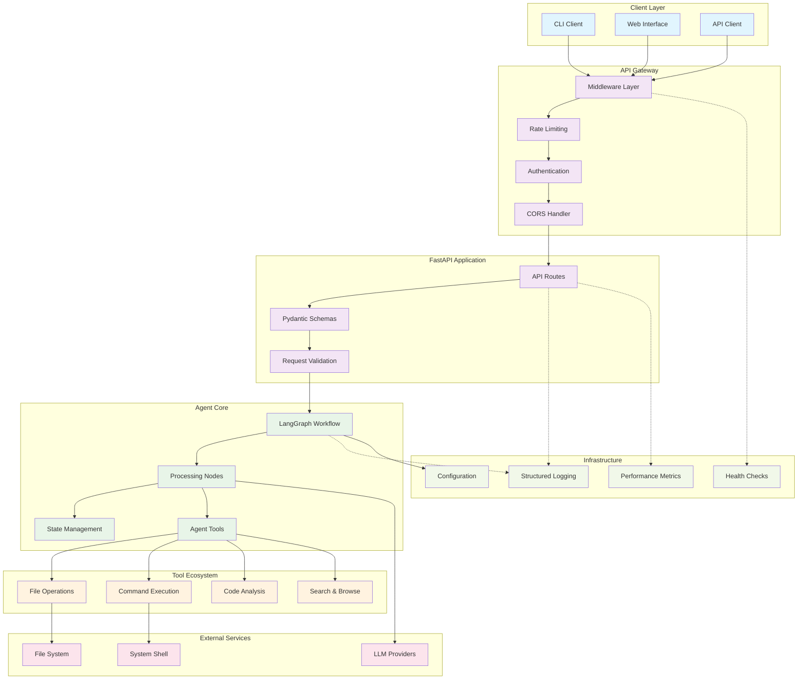
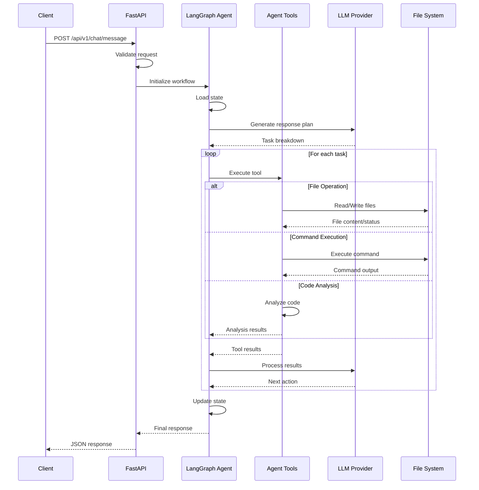

# Editor Agent

An AI-powered code editing agent built with FastAPI and LangGraph, designed to assist with code editing, analysis, and automation tasks.

## Features

- **AI-Powered Agent**: Built on LangGraph framework for sophisticated workflow management
- **RESTful API**: FastAPI-based service with comprehensive endpoints
- **Tool Integration**: File operations, command execution, and code analysis tools
- **Robust Infrastructure**: Comprehensive logging, monitoring, and error handling
- **Configurable**: Environment-based configuration with validation
- **Production Ready**: Rate limiting, security headers, and health checks

## Architecture

### System Overview



### Request Flow



### Project Structure

```
src/
├── agent/          # LangGraph agent implementation
│   ├── nodes.py    # Workflow nodes (processing steps)
│   ├── state.py    # State management for workflows
│   ├── tools.py    # Agent tools (file ops, commands, etc.)
│   └── workflow.py # LangGraph workflow definitions
├── api/            # FastAPI application
│   ├── routes.py   # API endpoints
│   └── schemas.py  # Pydantic models
├── config/         # Configuration management
│   └── settings.py # Environment settings
├── utils/          # Utilities and infrastructure
│   ├── exceptions.py # Custom exceptions and handlers
│   ├── logging.py    # Structured logging setup
│   ├── middleware.py # Custom middleware components
│   └── monitoring.py # Health checks and metrics
└── main.py         # Application entry point
```

## Quick Start

### Prerequisites

- Python 3.11+
- [uv](https://docs.astral.sh/uv/) package manager

### Installation

1. **Clone the repository**:
   ```bash
   git clone <repository-url>
   cd editor-agent
   ```

2. **Install dependencies**:
   ```bash
   uv sync
   ```

   For LLM functionality, install optional dependencies:
   ```bash
   uv sync --extra llm
   ```

3. **Set up environment variables**:
   ```bash
   cp .env.example .env
   # Edit .env with your configuration
   ```

4. **Run the application**:
   ```bash
   uv run python src/main.py
   ```

   Or using uvicorn directly:
   ```bash
   uv run uvicorn src.main:app --reload
   ```

### Development Setup

1. **Install development dependencies**:
   ```bash
   uv sync --dev --extra llm
   ```

2. **Run tests**:
   ```bash
   uv run pytest
   ```

3. **Code formatting and linting**:
   ```bash
   uv run black src/
   uv run isort src/
   uvx ruff check
   uv run mypy src/
   ```

## Configuration

The application uses environment variables for configuration. Copy `.env.example` to `.env` and customize:

### Required Settings

```env
# Application
APP_NAME="Editor Agent"
APP_VERSION="0.1.0"
ENVIRONMENT="development"
DEBUG=true

# Server
HOST="0.0.0.0"
PORT=8000

# AI Model (choose one)
OPENAI_API_KEY="your-openai-key"
# ANTHROPIC_API_KEY="your-anthropic-key"
# OLLAMA_BASE_URL="http://localhost:11434"
# OLLAMA_MODEL="llama2"

# Model Configuration
MODEL_PROVIDER="openai"  # Options: openai, anthropic, ollama
MODEL_NAME="gpt-4"
MODEL_TEMPERATURE=0.1
```

### Optional Settings

- **Security**: API keys, CORS origins, trusted hosts
- **Agent**: Max iterations, timeout, tool configurations
- **File System**: Working directory, allowed paths
- **Logging**: Level, file output, structured format
- **Monitoring**: Health check intervals, metrics collection

### LLM Dependencies

The project includes optional LLM client dependencies:
- `openai>=1.0.0` - For OpenAI API integration
- `anthropic>=0.7.0` - For Anthropic Claude API integration
- `ollama>=0.1.0` - For Ollama local model integration

Install with: `uv sync --extra llm`

### Supported LLM Providers

#### OpenAI
Set `MODEL_PROVIDER=openai` and provide your `OPENAI_API_KEY`.

#### Anthropic Claude
Set `MODEL_PROVIDER=anthropic` and provide your `ANTHROPIC_API_KEY`.

#### Ollama (Local Models)
Set `MODEL_PROVIDER=ollama` and configure:
- `OLLAMA_BASE_URL` - Ollama server URL (default: http://localhost:11434)
- `OLLAMA_MODEL` - Model name (e.g., llama2, codellama, mistral)

Ensure Ollama is running locally with your desired model pulled:
```bash
# Install and start Ollama
curl -fsSL https://ollama.ai/install.sh | sh
ollama serve

# Pull a model
ollama pull llama2
```

### Database (Supabase)

The application supports Supabase for data persistence. Configure with:

```env
# Supabase Configuration
SUPABASE_URL="https://your-project.supabase.co"
SUPABASE_KEY="your-anon-key"
SUPABASE_SERVICE_KEY="your-service-role-key"  # Optional, for admin operations
```

#### Setting up Supabase

1. **Create a Supabase project**:
   - Go to [supabase.com](https://supabase.com)
   - Create a new project
   - Note your project URL and anon key

2. **Run database migrations**:
   ```bash
   # Install Supabase CLI
   npm install -g supabase
   
   # Initialize Supabase in your project
   supabase init
   
   # Link to your project
   supabase link --project-ref your-project-ref
   
   # Run migrations
   supabase db push
   ```

3. **Apply the schema**:
   Execute the SQL in `migrations/001_initial_schema.sql` in your Supabase SQL editor or use:
   ```bash
   supabase db reset
   ```

#### Database Features

The Supabase integration provides:

- **User Profiles**: Store user preferences and metadata
- **Chat Sessions**: Persist conversation history
- **Chat Messages**: Store individual messages with metadata
- **Agent Tasks**: Track agent task execution
- **Agent Executions**: Log detailed execution steps
- **File Operations**: Audit trail for file changes
- **Row Level Security**: User data isolation
- **Real-time subscriptions**: Live updates (future feature)

#### Database Models

Key database models include:

- `UserProfile`: User account information and preferences
- `ChatSession`: Conversation sessions with context
- `ChatMessage`: Individual messages with role and metadata
- `AgentTask`: High-level tasks assigned to the agent
- `AgentExecution`: Detailed execution steps and logs
- `FileOperation`: File system operation audit trail

See `src/database/models.py` for complete model definitions.

See `.env.example` for complete configuration options.

## API Usage

Once running, the API will be available at `http://localhost:8000`.

### Interactive Documentation

- **Swagger UI**: `http://localhost:8000/docs`
- **ReDoc**: `http://localhost:8000/redoc`

### Key Endpoints

#### Chat with Agent
```bash
curl -X POST "http://localhost:8000/api/v1/chat" \
  -H "Content-Type: application/json" \
  -d '{
    "message": "Help me refactor this Python function",
    "session_id": "my-session"
  }'
```

#### Execute Agent Task
```bash
curl -X POST "http://localhost:8000/api/v1/agent/execute" \
  -H "Content-Type: application/json" \
  -d '{
    "task": "Analyze the code in src/main.py and suggest improvements",
    "config": {
      "max_iterations": 10,
      "timeout": 300
    }
  }'
```

#### Health Check
```bash
curl "http://localhost:8000/health"
```

#### System Metrics
```bash
curl "http://localhost:8000/metrics"
```

## Agent Capabilities

The agent comes with built-in tools for:

### File Operations
- **Read files**: View file contents
- **Write files**: Create or modify files
- **List directories**: Browse file system
- **Search files**: Find files by pattern

### Code Analysis
- **Syntax checking**: Validate code syntax
- **Code review**: Suggest improvements
- **Refactoring**: Restructure code
- **Documentation**: Generate docs

### Command Execution
- **Shell commands**: Execute system commands
- **Build tools**: Run build processes
- **Testing**: Execute test suites
- **Git operations**: Version control tasks

### Workflow Management
- **Multi-step tasks**: Complex workflows
- **State persistence**: Maintain context
- **Error recovery**: Handle failures gracefully
- **Progress tracking**: Monitor task execution

## Monitoring and Observability

### Health Checks
The application provides comprehensive health checks:
- Application status
- System resources (CPU, memory, disk)
- External dependencies

### Metrics
Built-in metrics collection:
- Request counts and response times
- Error rates and types
- System resource usage
- Agent performance metrics

### Logging
Structured logging with:
- Request/response logging
- Agent execution traces
- Performance metrics
- Error tracking

## Security

### Authentication
- API key authentication (optional)
- Request rate limiting
- CORS configuration

### Security Headers
- Content Security Policy
- X-Frame-Options
- X-Content-Type-Options
- Strict-Transport-Security

### Input Validation
- Request size limits
- Input sanitization
- Path traversal protection

## Deployment

### Docker

```dockerfile
# Example Dockerfile
FROM python:3.11-slim

WORKDIR /app
COPY . .

RUN pip install uv
RUN uv sync --frozen

EXPOSE 8000
CMD ["uv", "run", "python", "src/main.py"]
```

### Production Considerations

1. **Environment Variables**: Use secure secret management
2. **Reverse Proxy**: Deploy behind nginx/traefik
3. **SSL/TLS**: Enable HTTPS in production
4. **Monitoring**: Set up application monitoring
5. **Logging**: Configure centralized logging
6. **Scaling**: Consider horizontal scaling needs

## Development

### Project Structure

The project follows a modular architecture:

- **Agent Layer**: LangGraph workflows and tools
- **API Layer**: FastAPI routes and schemas
- **Infrastructure Layer**: Logging, monitoring, middleware
- **Configuration Layer**: Settings and environment management

### Adding New Tools

1. Create tool class in `src/agent/tools.py`:
   ```python
   class MyCustomTool(BaseTool):
       name = "my_tool"
       description = "Description of what the tool does"
       
       async def execute(self, **kwargs) -> str:
           # Tool implementation
           return "Tool result"
   ```

2. Register in tool registry:
   ```python
   TOOL_REGISTRY["my_tool"] = MyCustomTool()
   ```

### Adding New Endpoints

1. Define schemas in `src/api/schemas.py`
2. Add routes in `src/api/routes.py`
3. Update documentation

### Testing

Run the test suite:
```bash
uv run pytest tests/ -v
```

With coverage:
```bash
uv run pytest tests/ --cov=src --cov-report=html
```

Current test coverage: **86%** (286 tests passing)

Note: Some tests require LLM dependencies (`openai`, `anthropic`). Install with `--extra llm` to run the full test suite.

## Troubleshooting

### Common Issues

1. **Import Errors**: Ensure all dependencies are installed with `uv sync`
2. **API Key Issues**: Verify environment variables are set correctly
3. **Port Conflicts**: Change PORT in `.env` if 8000 is occupied
4. **Permission Errors**: Check file system permissions for working directory

### Debug Mode

Enable debug mode in `.env`:
```env
DEBUG=true
LOG_LEVEL=DEBUG
```

This enables:
- Detailed error messages
- Request/response logging
- Interactive API documentation
- Auto-reload on code changes

### Logs

Logs are written to:
- Console (structured JSON in production)
- File: `logs/app.log` (if configured)

## Contributing

1. Fork the repository
2. Create a feature branch
3. Make your changes
4. Add tests for new functionality
5. Run the test suite
6. Submit a pull request

### Code Style

The project uses:
- **Black** for code formatting
- **isort** for import sorting
- **flake8** for linting
- **mypy** for type checking

Run all checks:
```bash
uv run black src/ tests/
uv run isort src/ tests/
uvx ruff check
uv run mypy src/
```

## License

[Add your license information here]

## Support

For questions and support:
- Create an issue in the repository
- Check the documentation
- Review the API documentation at `/docs`

---

**Built with ❤️ using FastAPI and LangGraph**